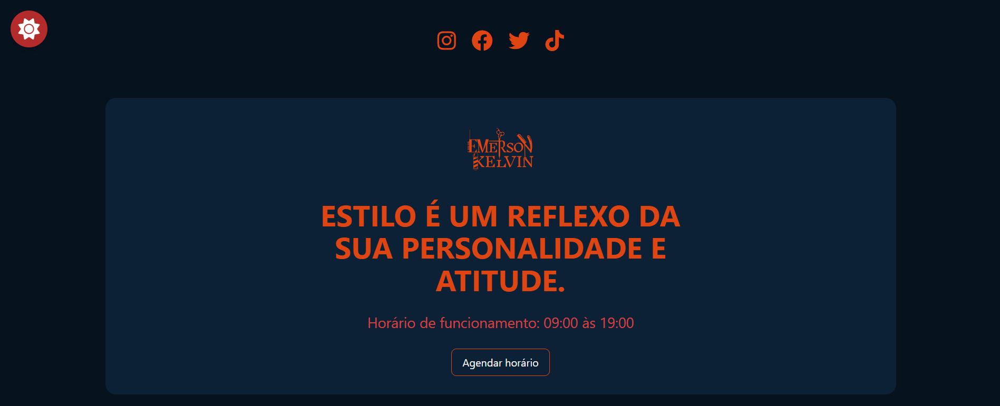
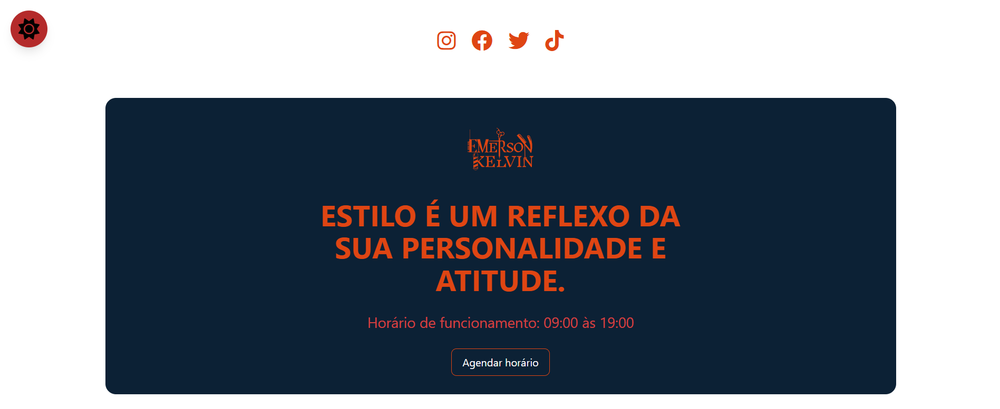

# Login Form ✅






```
barbearia-emerson-kelvin/
│
├── assets/                     
|   └── bg.svg
|   └── corte1.png
|   └── corte2.png
|   └── corte3.png
|   └── images.svg
|   └── logo-black.svg
|   └── logo.svg
|   └── whatsapp.svg
├── node_modules/                                  
├── style/                               
│   └── output.css 
|   └── style.css    
├── index.html                  
├── microservices.html
├── Package-lock.json
├── Package.json
├── tailwind.config.js
├── theme-dark.png
├── theme-light.png
|                   
└── README.md            
```
[](https://choosealicense.com/licenses/mit/)

### Este projeto é uma aplicação web para a Barbearia Emerson Kelvin, um estabelecimento dedicado ao atendimento de qualidade no setor de serviços de corte e cuidados de cabelo e barba. O objetivo do projeto é fornecer uma interface fácil de usar para os clientes agendarem seus horários, conhecerem os serviços oferecidos e entrarem em contato com a barbearia.

#### Funcionalidades para qual foi criado 😎

- Agendamento de Horário: Os clientes podem agendar cortes de cabelo e outros serviços diretamente no site.

- Serviços e Preços: Exibição detalhada dos serviços oferecidos e seus preços

- Localização: Mapa interativo com a localização da barbearia.

- Tema Claro e Escuro: Alternância entre temas claro e escuro para uma melhor experiência do usuário.

- Redes Sociais: Links para as redes sociais da barbearia.

# Tecnologias Utilizadas

## **Front-end:**

<a href="#" target="_blank"></a>

<a href="#" target="_blank"></a>

<a href="#" target="_blank"></a>

<a href="#" target="_blank"></a>


## Lembre-se !!

### Não foram feitos testes de validação, apenas foi criado a parte  visual.


## Contribuição

* Se quiser contribuir para este projeto:

- Faça um fork do repositório.

- Crie um branch para suas modificações:

```

git checkout -b "minha-feature"

```

- Submeta um pull request com a descrição das suas alterações.


# Obrigado 😎👍


